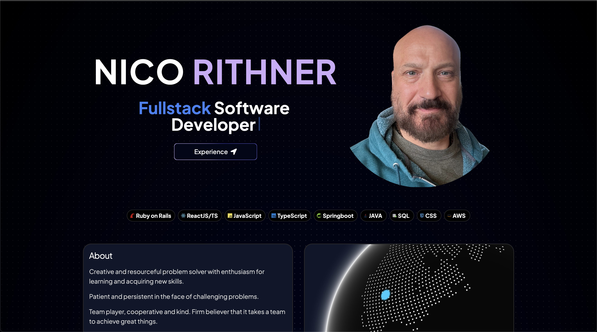
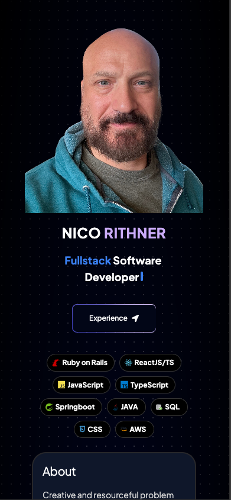

  
  # Nico Rithner
  

  &nbsp;&nbsp;&nbsp;&nbsp;
  &nbsp;&nbsp;&nbsp;&nbsp;
  &nbsp;&nbsp;&nbsp;&nbsp;
   

👨🏻‍💻   Full Stack Software Engineer

📚   Trained at [Turing School of Software and Design](https://turing.io/). Back end program - cohort 2006.

  
   
  
   

    
  
    
  

 

  ## Recent Frontend Projects 🖼️

  

  <a href="https://www.drakkarweightlifting.com" target="_blank" rel="noopener noreferrer">
    
    &nbsp;&nbsp;
    
  </a>

  <a href="https://www.nicorithner.com" target="_blank" rel="noopener noreferrer">
    
    &nbsp;&nbsp;
    
  </a>

  ## My Frontend Mentor Projects 🎨
  
  [My frontendmentor completed projects](https://www.frontendmentor.io/profile/nicorithner) - link to live page and github repos included.
  
  Frontend Mentor is a website where you can access different project assignments to practice several FE skills in a similar way one does at work.
The assignments only provide you with stories, mockups, Figma or Sketch files and once completed the project has to be published using github pages.

  

 <!-- 
  
  
 -->

   

<!--
**nicorithner/nicorithner** is a ✨ _special_ ✨ repository because its `README.md` (this file) appears on your GitHub profile.
